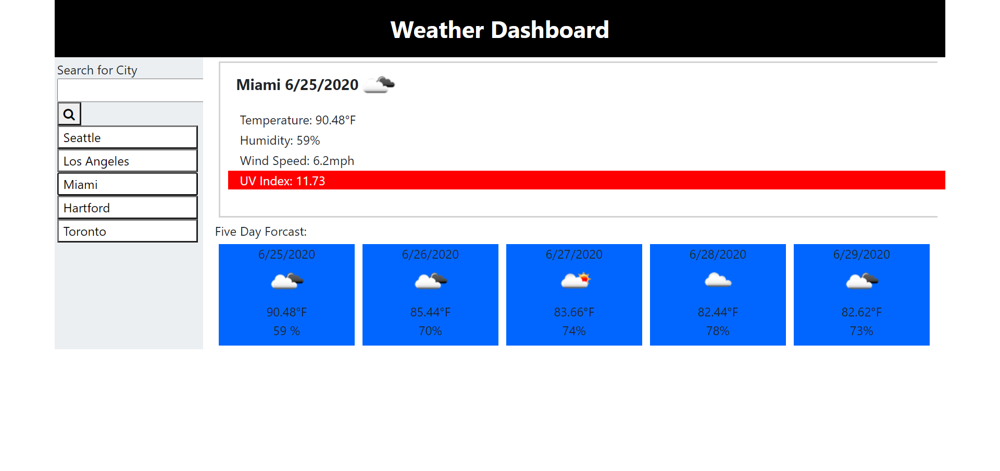

# Weather Dashboard

<h3><---------- Laptop and Mobile Use ----------></h3>

<h1>Installation</h1>
    

With creating this simple application I first found a weather API that shows the current weather data, as well as a five day forecast data for all major cities in the United States. Then using HTML and CSS I created a simple weatherdashboard to display the data being recieved. Using javaScript, jQuery, and an AJAX call, I was able to fetch the data from the weather API and use it to display the weather in any major city that the user searches in the search bar.

<h1>Usage</h1>

The purpose of this application is for users who want to play with their favorite players on their team. Or for users who just want to relax and play some games.The first page will show a roster of teams. Pick five players from any team. Once five players are picked, you will be directed to a game where you try to do as many free throws as you can. What you will see in this application is an unfinished product of the application. There is till more work that needs to be done.

<h1>Contributors</h1>

<h3>Frontend and Backend</h3>
<ul>
    <li>Github: justindurocher </li>
</ul>
<h1>Credits</h1>
<ul>
    <li>www.youtube.com</li>
    <li>www.github.com</li>
    <li>www.gitlab.com</li>
    <li>www.google.com</li>
    <li>www.stackoverflow.com</li>
    <li>Visual Studio Code</li>
    <li>WeatherApi</li>
</ul>

